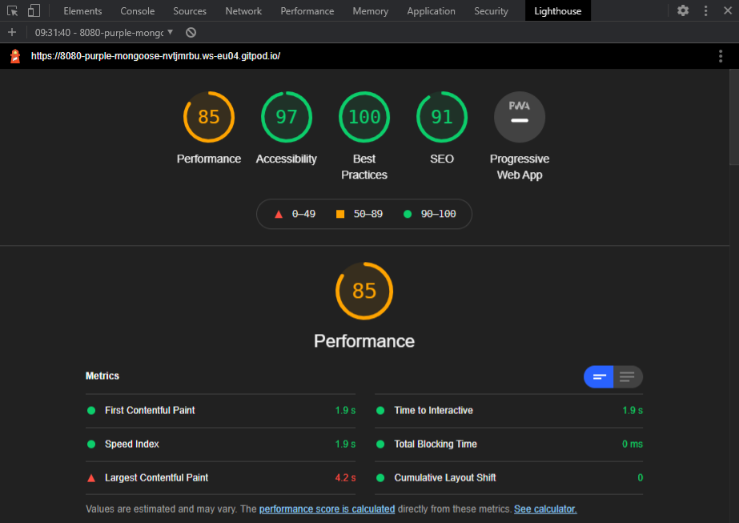
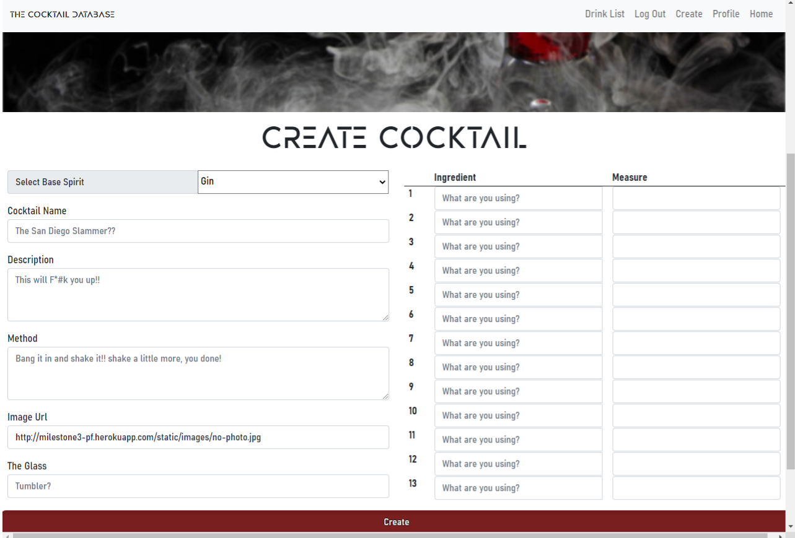
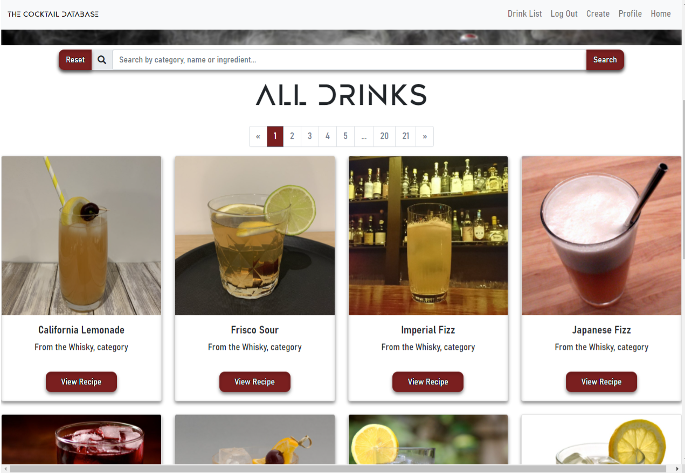
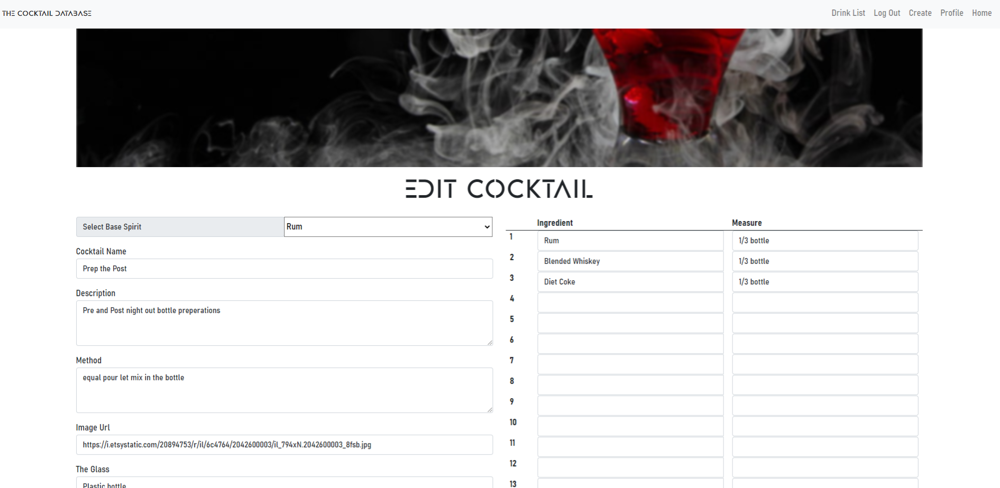
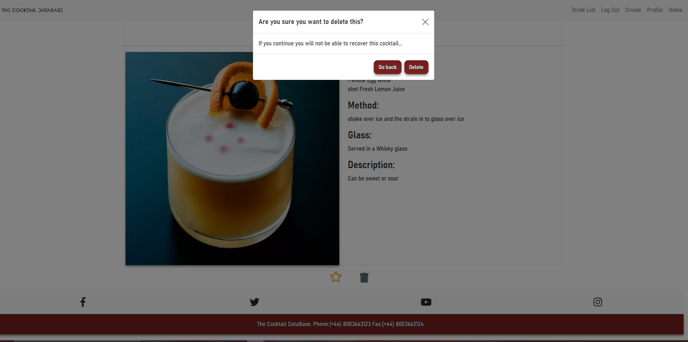

This is the testing document for the website created as my data-centric milestone submission for code
 institutes full stack developer course. [Click](https://milestone3-pf.herokuapp.com/) for the live version. 
 The cocktail database is a collaborative cocktail recipe site with the goal of allowing users to discover new cocktails
  as well as sharing their own cocktail recipes and ideas.Users can create their own account with allows them to search the database,
   add and edit their own cocktails as well as build a personal collection on their profile of their favourite cocktail recipes.

# Code Validation

### HTML

- Passing the HTML from all templates and base into the [W3C Markup Validator](https://validator.w3.org/) generates numerous errors, but these are expected as the validator is unable to understand the Jinja templating that builds most aspects of the page. For the HTML that does not involve Jinja, no errors have been found.
### CSS

- The CSS has been validatedby passing the CSS through the [W3C CSS Validation Service](https://jigsaw.w3.org/css-validator/) shows that there are no errors. A no or errors warnings are flagged.
### Javascript

- All Javascript was passes throught the [JSHint Validator](https://jshint.com/) and was found to be syntactically valid.
### Python

- All Python code was passed through the [PEP8 Online](http://pep8online.com/) validator and is fully PEP8 compliant.

# Links testing

- All links contained within the site were manually tested to ensure that they acted in the intended manner.
- The four social media links in the footer correctly open in new tabs.
- Buttons and navigation links checked for correct and inteneded on hover or focus css.

# Navigation

- Manual testing was applied on the full navbar and collapsed navbar ensuring the links were not broken
- Testing that the navbar collapsed at the correct point and that media quieries impplimented the changes designed.

# Accesibility 

Testing for the Accesibility was done through lighthouse in chrome dev tools acheiving 95 and above. With issues being headings, text for icon links, 
and contrast which i plan to address at a later stage with a dark mode css update. 

# Device Testing and Compatability

The project was tested to ensure full usability across the following browsers and their mobile equivalents (where applicable):
- Chrome
- Edge
- Firefox
- Opera GX
- Internet Explorer

The site was tested for devices:
Physical:
- Huawei P30pro
- Samsung Galaxy S7
- Desktop
- Laptop
- Amazon Fire 7
Software Emulated:
- Moto g4
- Samsung Galaxy S7
- Pixel 2
- Pixel 2XL
- Iphone 5/SE
- Iphone 6/7/8
- Iphone 6/7/8 plus
- Iphone X
- Ipad
- Ipad Pro 
- Surface Duo 

This process including using [Ghost css](http://wernull.com/2013/04/debug-ghost-css-elements-causing-unwanted-scrolling/) allowed me to design 
a responsive website enviroment

# Bugs

During the development process the notable bugs (the time consuming) i came across are listed in this section

- Bug 1
Display recipe page displays empty ingredient fields
- Fix 1
Code written that targets the ingredients and changes display to none if the inner html is equal to none
- Bug 2
Pagination for search criteria only showing first page due to search bar no longer containing the search criteria creating a error  $search format = null
-  Fix 2
This was fixed by creating a empty global string variable which is only updated when a search is entered allowing me to set teh value of the variable to the
searchbar allowing the pagination code to run
- Bug 3
Edit page not displaying values in text areas passed in from the edit recipe function
- Fix 3
This issue was easily resolved but took me time as text areas do not have value element and needed to be entered as the html text itself
- Bug 4
Page going over view port size creating a scrollbar
- Fix 4
This was fixed with the help of ghost css, as it showed that using a bootstrap in the footer in "base.html" was causing the 
problem with this removed the issue was resolved.

___

# Create , Read, Update, Delete

Testing for this was manual testing each indiviual back-end function to ensure it functioned correctly and
was linked with the front-end in a way that achieved a clear purpose and navigation. Examples of this are listed below.

## Create

For testing of this:
- Register this is first stage create (check database for correct input)
- Navigate to add cocktail and submit details this process was done muliple times to allow for enough items for deleions
 (check database for correct details)

## Read

For testing of this:
- Profile page shows username being displayed (check database for correct results)
- Navigate to drinks list cocktails from the populated database are displayed correctly (check database for correct results)
- Use searchbar correct results are displayed showing correct read functionality (check database for correct results)

## Update

For testing of this:
- For each cocktails creation a edit was made (check database for correct results)

## Delete

For testing of this:

- This was tested by creating profiles to delete for the profile delete function (check database for correct results)
- Deletion of individual recipes (check database for correct results)
